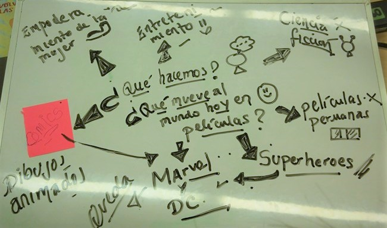
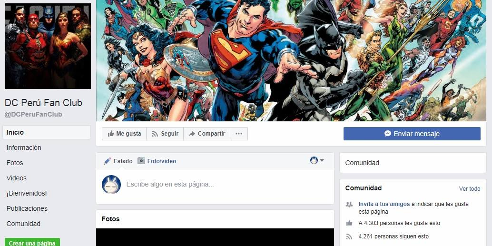
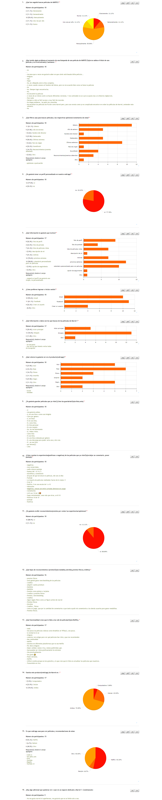

# MarvelFans
MrvelFans es un espacio virtual dedicado a los fans de las películas de Marvel, donde pueden encontrar toda la información relacionada a cada película, armar su propia colección de películas vista o pendientes, tener un calendario de eventos y ver las ultimas noticias.

## Desarrollado para
[Laboratoria](http://laboratoria.la)
***
# PROYECTO: MarvelFans

## Participantes:
- Nataly Cortez
- Elena Japa
- Maria Cristina Ortiz
- Pamela Rojas
***

## Descripción:

MARVEL FANS es un espacio virtual(web-app) dedicado a los fans de las películas de Marvel, donde pueden encontrar toda la información relacionada a cada película, armar su propia colección de películas vista o pendientes, tener un calendario de eventos y ver las ultimas noticias.
***

## Planificación
Se uso la herramienta TRELLO para la organizació de las actividades.

[Trello](https://trello.com/b/SIMvzP2T/marvel-fans)
***
## PROCESO DE DESARROLLO
## A.- RESEARCH

### Descubrimiento e investigación: ¿Cómo llegamos a esta idea?
Por medio de un brainstorming se eligió 2 ideas: Marvel y DC

### Síntesis y definición: Elección: Marvel
La elección de Marvel se validó por la cantidad de seguidores( fans) en facebook, en este caso Marvel tenía más cantidad de seguidores.

### Descubrimiento e investigación ¿Qué es lo que tendrá nuestro espacio virtual?
Se hizo un encuesta online para definir las componentes y funcionalidades que tendría el espacio virtual.

- Público-meta: Integrantes del club de fans de Marvel en Facebook
- Recurso Utilizado: OnlineEncuesta
- Número de encuestados: 18

### Síntesis y definición: Componentes y funcionalidades
A partir de la encuesta realizada se sintetizó la información y se obtuvieron  los componentes y funcionalidades:

- Registro/Sign in/Log in
- Perfil de usuario
- Búsqueda por filtros
- Amigos/Seguidores (pendiente)
- Chat Grupal (pendiente)
- Sección de Noticias
- Calendario

## B.- PROTOTIPO

***
## Herramientas de programación
- HTML5
- Jquery
- Bootstrap
- JavaScript
- CSS3
- Firebase
- OMDb API
