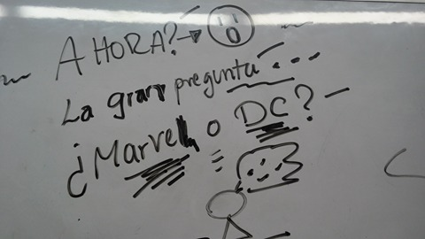
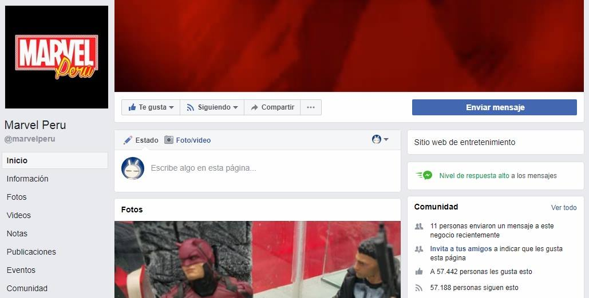
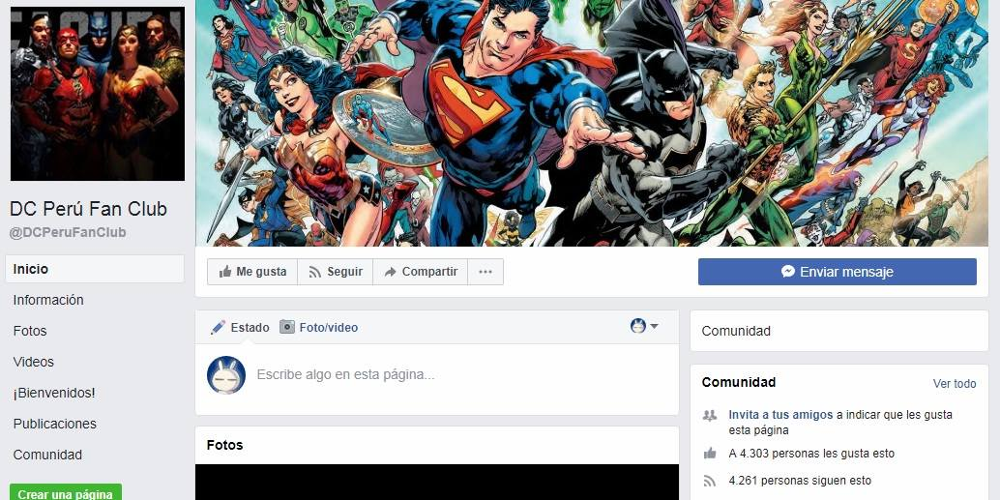
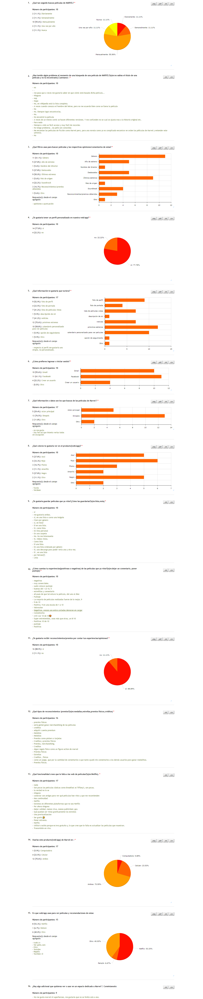
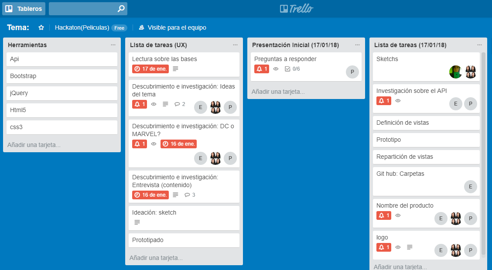

# Proyecto: Marvel Fans

## Participantes:
- Nataly Cortez
- Elena Japa
- Maria Cristina Ortiz
- Pamela Rojas

## Descripción:

Un espacio virtual dedicado a los fans de las películas de Marvel, donde puedan encontrar toda la información relacionada a cada película, armar su propia colección de películas por ver y compartir sus opiniones con toda la comunidad.

## ¿Cómo llegamos a esta idea?

## Elección: Marvel

## Research:
- Público-meta: Integrantes del club de fans de Marvel en Facebook
- Recurso Utilizado: OnlineEncuesta
- Número de encuestados: 18

## Objetivos:
- Registro/Sign in/Log in
- Perfil de usuario
- Búsqueda por filtros
- Amigos/Seguidores
- Chat Grupal
- Sección de Noticias
- Calendario

## Herramientas a utilizar:
- HTML5
- Jquery
- Bootstrap
- JavaScript
- CSS3
- Firebase
- OMDb API

## Organización:

Link de Trello: https://trello.com/b/SIMvzP2T/tema

